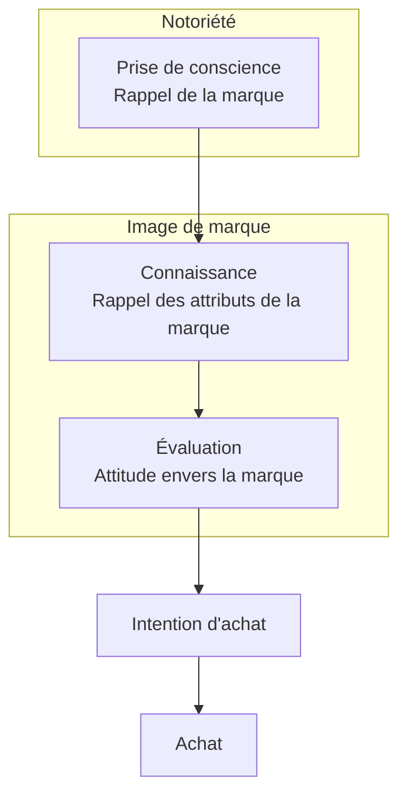

---
tags:
  - études/Marketing
aliases:
  - SMART
---
> [!info] Définir des objectifs SMART
>  spécifiques, mesurables, atteignables, réalistes et temporels.

- S: make the goal specific and narrow for effective planning
- M: the goal and progress are mesurable
- A: can accomplish the goal within a certain time frame
- R: goal align with my value and my long-term objectives
- T: set a realistic but ambitious end date to clarify task prioritization and increase motivation

###### Quels sont nos intentions ?
