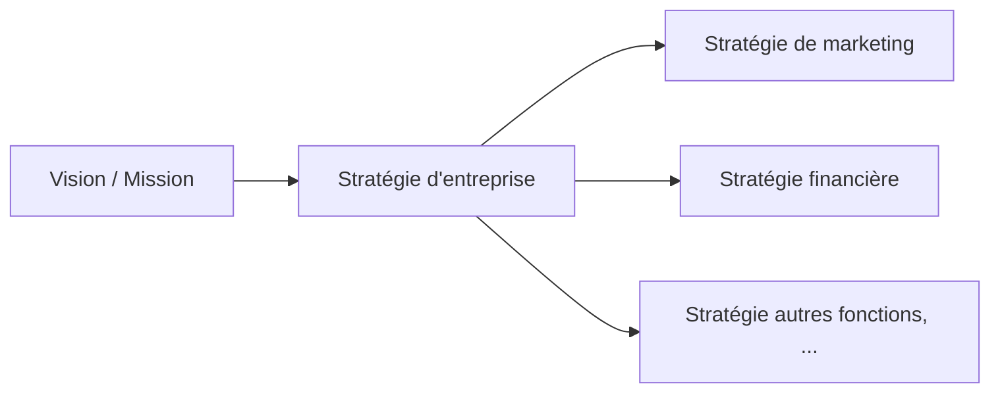
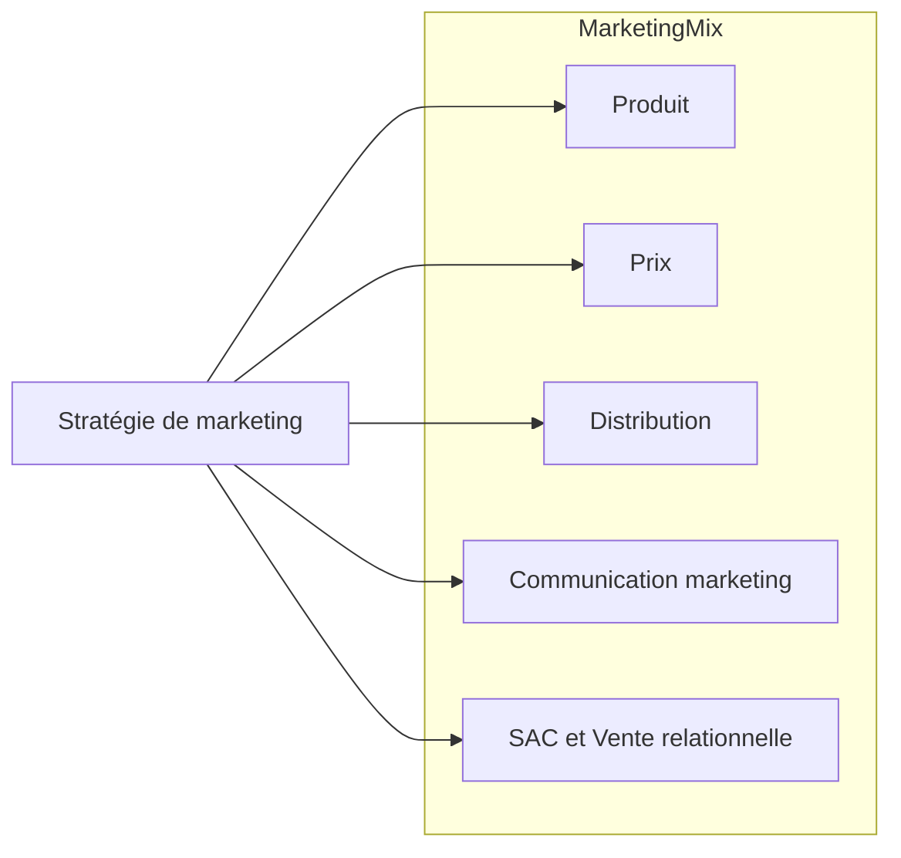

---
tags:
  - marketing
  - études/Marketing
---
##### TO DO
- [ ] add contenus de cours 
	- [ ] mindmap papier rapide des concepts après relecture des diapo
	- [ ] demander a [[NotebookLM - IA|NotebookLM]]
	- [ ] ramener les informations ici 
	- [ ] faire un max de joli lien et sous fiche
- [ ] rajouter lecture des livre de Annie en Marketing par [[NotebookLM - IA|NotebookLM]]
- [ ] mettre plus de lien et des joli processus

###### Fiche a revoir
- [[créer un effet de réseau]]
- 

#### Sommaire
## Concept Fondamentaux

###### Pourquoi le Marketing est important ? 
Le marketing sert à 
- comprendre du mieux possible son [[comprendre le consommateur|consommateur]] afin de maximiser ses ventes
- [[comprendre les besoins (et désirs)]] des clients et tenter d’y répondre avec la bonne offre.
- optimiser la relation d’[[échanges]] entre 
	- l’entreprise et le client 
	- en maximisant leurs degrés de satisfaction respectifs

###### **Comment le marketing a-t-il évolué?**
- **Approche produit** : 
	- Se concentrer sur la fabrication du meilleur produit possible
- **Approche production**:
	- Met l’accent sur l’efficacité de la production.
- **Approche vente**: 
	- Élaborer une stratégie pour convaincre les consommateurs d’acheter.
- **Approche marketing** : 
	- Miser sur la satisfaction des clients et les comprendre. Cette approche considère :
	    - L'existence d'un bassin de clients potentiels.
	    - Le coût du produit.
	    - La satisfaction du client après l'achat.
	    - La fidélisation de la clientèle.
	    - La [[demande]] pour le produit.
	    - La qualité du produit.

###### **Que fait le marketing concrètement?**
Le but du marketing est d'optimiser la relation d'échange entre l'entreprise et le client, en maximisant leur satisfaction.
- Cela passe par la compréhension des besoins, des désirs et des attentes des clients.
	- La valeur d'un échange se calcule par les bénéfices moins les coûts ($, fatigue, temps, effort).
- La fidélité est mesurée par le taux de conservation des clients et la proportion d'achats pertinents.
- La qualité du service ou du produit

> La satisfaction client est primordiale, car il est moins coûteux de conserver des clients que d'en attirer de nouveaux.
#### Positionnement du Marketing dans l'entreprise

###### Le Mix Marketing

-----

## Le Processus Marketing - *Quand et Comment le marketing est il impliqué?*

 Le marketing est impliqué dans toutes les étapes de la planification:
 - **Stratégie d'entreprise** où l'on détermine la vision et la mission.
 - **Stratégie de marketing** qui comprend le produit, le prix, la distribution et la communication.
 - Le **[[plan marketing]]**

###### Le plan marketing
1. [[Analyse de la situation]]
2. [[Détermination des objectifs marketing]]
3. [[Affectation des ressources]]
4. Détermination de la [[stratégie marketing]]
	1. *Segmentation, Ciblage, Positionnement*
5. Détermination du [[mix marketing]] 
	1. *Produit, Prix, Distribution, Communication*
6. [[Mise en œuvre]]
7. [[Contrôle et plan de rechange]]

##### Marketing dans les **[[Cycle du contrôle - Marketing|Cycles du contrôle]]**
**Le contrôle** est un processus continu d'évaluation des résultats, de l'atteinte des objectifs et du respect de la planification.
- Objectifs, Moyens d’action, Normes
- Mesures de rendement
- Analyse des causes
- Actions correctives

##### SIM
**[[Système d'information marketing]] (SIM)** : Collecte et analyse de données pour prendre des décisions en marketing.
- **Données primaires** et **données secondaires**.
- **Types de recherche marketing** : exploratoire, descriptive et causale

## Comportement du Consommateur
-> [[comprendre le consommateur]]

###### **Processus de décision rationnel**  du consommateur comprend:
- Reconnaissance d'un besoin.
- Recherche d'informations 
	- sources internes et externes.
- Évaluation des options.
- Décision d'achat 
	- modèles compensatoires et non compensatoires.
- Acte d'achat.
- Évaluation post-achat.

###### **Limites du processus rationnel**
- Implication, complexité, situation, facteurs émotionnels

###### **Sources d'influence** sur le consommateur:
- **[[Influences internes]]** 
- **[[Influences externes]]** 

## Stratégie d'Entreprise
- [[Stratégie VS tactique]]
- [[stratégie concurentielle]]
- [[Stratégie de développement]]
	- [[Analyse de position stratégique]]

