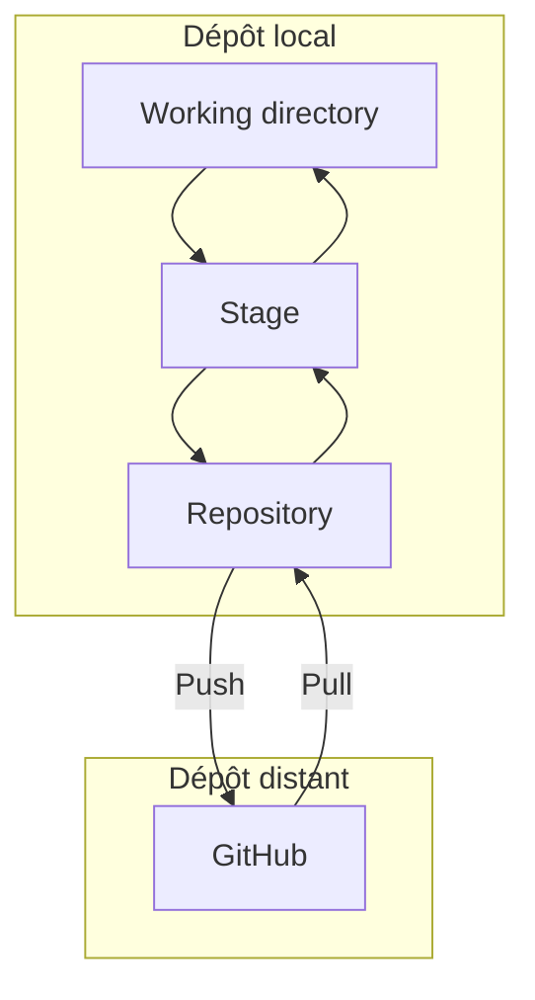

---
tags:
  - coding/git
aliases:
  - coding/git
---


> [!info] GIT: a Free and open source version control system
> ici on explique la logique de Git afin de l'utiliser convenablement

- [ ] good version avant le weird bug

[[GitHub]] is a website where you can share your document in a Git environment. 

###### Sommaire:
- [[Git VS GitHub]]
- [[Git Commands]]
- [[Pull request]]

Gestion des versions quand une équipe
- [[Journalisation de Git]]
- [[Git Reset]]
- [[Git revert]]
- [[Git Blame]]


-----

#### créer un dépôt local vide
1. **ce positionner dans le dossier:**
	1. cd ~/Documents/PremierProjet  
2. **transformer ce simple dossier en dépôt:**
	1. $ git init



##### Explication
###### **Le Working directory**
Cette zone correspond au dossier du projet sur votre ordinateur.

Souvenez-vous, dans la partie précédente nous avons initialisé le dépôt “PremierProjet”. Eh bien ce dépôt, c’est la zone bleue du schéma.

###### **Le Stage ou index**
Cette zone est un intermédiaire entre le working directory et le repository. Elle représente tous les fichiers modifiés que vous souhaitez voir apparaître dans votre prochaine version de code.

> Le terme “stage” est aussi beaucoup utilisé par les développeurs à la place du terme “index”. On peut dire “indexer un fichier” ou “stage un fichier”.

###### **Le Repository**
Lorsque l’on crée de nouvelles versions d’un projet, c’est dans cette zone qu’elles sont stockées.

Ces 3 zones sont donc présentes dans votre ordinateur, en local.

En-dessous, vous trouvez le repository GitHub, c’est-à-dire votre dépôt distant.

### Set up d'un nouveau GIT

```shell
cd ~/Documents         # Accédez à Documents
mkdir MonNouveauProjet  # Crée un nouveau dossier MonNouveauProjet
cd MonNouveauProjet # Entrez dans le dossier
git init # Initialise un dépôt Git
touch README.md # Crée un fichier README.md
```
###### Push sur [[GitHub]]
Pour envoyer du code sur GitHub, 2 protocoles 
- HTTPS : on vous demandera une confirmation de votre identifiant et mot de passe pour chaque action sensible
-  SSH, qui fonctionne via un système de clés privées et publiques.


###### SSH
-> [clé SSH Documentation GitHub](https://docs.github.com/fr/authentication/connecting-to-github-with-ssh/generating-a-new-ssh-key-and-adding-it-to-the-ssh-agent)
Une clé Secure Shell, ou clé SSH, permet d’assurer une connexion sécurisée entre votre réseau et un dépôt distant sécurisé. C'est très utile quand vous avez besoin de vous authentifier sur une machine tierce, car cela vous évite d’avoir à vous identifier systématiquement.

> Une clé SSH privée est **unique et personnelle**.


##### Cloner code sur GitHub sur samachine
Aller dans le répertoire -> Code -> Clone HTTPS
Puis dans la console: `git clone CTR+V`


-----

### Usage quotidien
**Étapes Générales d'une utilisation basic:**
1. **Changer de branche** :
   ```bash
    git checkout nom_de_la_branche
    ```
    - Ou créer une nouvelle branche :
    ```bash
    git checkout -b nouvelle_branche
    ```
2. **Modifier votre fichier** dans votre éditeur de texte ou IDE.
3. **Enregistrer les modifications** dans votre éditeur (Ctrl+S).
4. **Ajouter les modifications à la zone de staging** (index) :
    - Pour un fichier spécifique :
        ```bash
        git add nom_du_fichier
        ```
    - Pour tous les fichiers modifiés :
        ```bash
        git add .
        ```
5. **Créer un commit** pour sauvegarder les modifications avec un message :
    ```bash
    git commit -m "Votre message descriptif ici"
    ```
6. **Envoyer les modifications vers le dépôt distant** (si nécessaire) :
    ```bash
    git push origin nom_de_la_branche
    ```


> flux de travail Git : **modifier → ajouter → committer → pousser**. 🚀

##### 3 phases de gestion des version
1. Untracked
2. staging
	1. <=> preparer a le partager
3. Commit
	1. <=> enregistrement dans le dépôt !!


### les branches
-> [[Git Commands#Les branches|commandes des branches]]

La branche va fonctionner comme un dossier virtuel. Avec **git checkout**, on va être téléporté dans le dossier virtuel Cagnotte. On reste dans le dossier OC physiquement, mais virtuellement nous sommes passés dans un monde parallèle !


# Lexique
**version control system:** management of change in document -> See [branching].

CLI: Command Line Interface


"En local" signifie sur votre machine, par opposition à "en ligne".

Repository: project / the folder where the project si kept


# Ressource
[Gérez du code avec Git et GitHub - OpenClassrooms](https://openclassrooms.com/fr/courses/7162856-gerez-du-code-avec-git-et-github/7165721-installez-git-sur-votre-ordinateur)
- [Git Tutorial For Dummies - YouTube](https://www.youtube.com/watch?v=mJ-qvsxPHpY)
